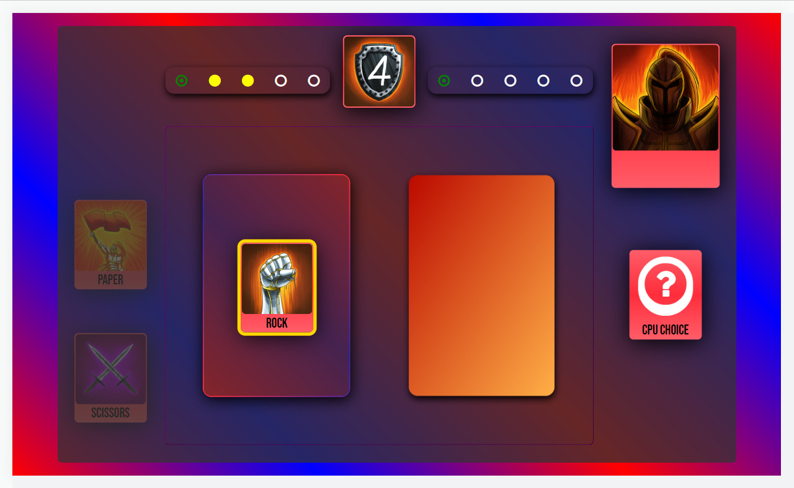

#  Rock Paper Scissors | <a href="https://mattxmade.github.io/odin-rock-paper-scissors"> <strong>Live</strong></a>

> ### JavaScript project based on the classic game

 

  
   

##

### About

A program that pits a human player vs the computer in a game of rock papper scissors.

##

### Todo

- [x] Welcome user to game
- [x] Handle user selection
- [x] Return a randomised computer choice
- [x] Log win, loss or draw
- [x] Create points system
- [x] Determine winner
- [x] Add different message if player win losses or draws
- [x] Confirm if user would like to play again
- [x] Check for bugs

##

### Deployment

(<a href="#readme-top">back to top</a>)

